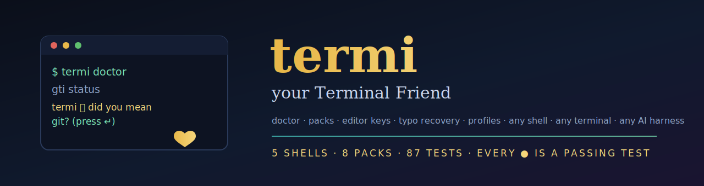
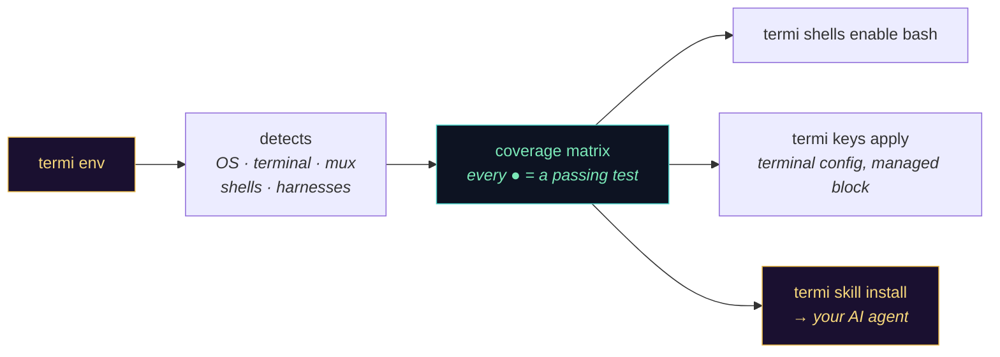
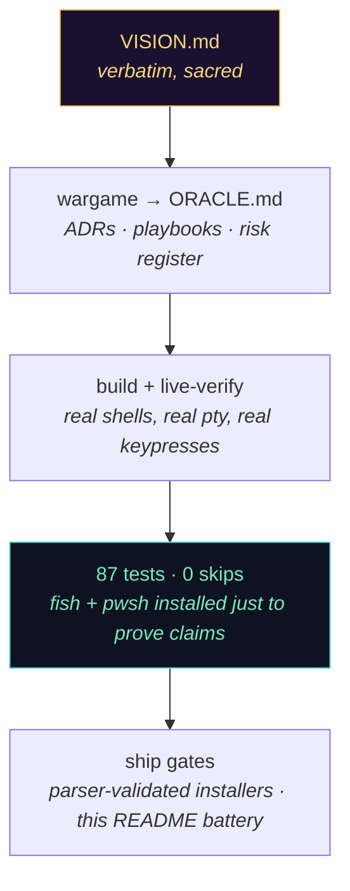

<div align="center">



[](https://github.com/fire17/termi/releases)
[](https://github.com/fire17/termi/actions/workflows/ci.yml)
[](tests/)
[](support/shells.toml)
[](bin/termi)
[](ORACLE.md)
[](LICENSE)
[](https://github.com/fire17/termi/stargazers)

<i>The terminal you love, everywhere — and a friend who never lies about what works.</i>

**[⚡ Quickstart](#-quickstart)** · **[🩺 What it does](#-what-your-friend-does)** · **[🌍 Any shell](#-any-shell-any-terminal-any-os)** · **[🤖 AI harnesses](#-the-part-that-should-stop-you)** · **[🛟 Safety](#-safety--undo)** · **[🔬 Making of](#-how-this-was-actually-built)**

</div>

---

## 🤖 The part that should stop you

**termi installs itself into your AI agent — and its coverage matrix is incapable of overstating.**

- `termi skill install` detects whatever AI harness lives on your machine — **Claude Code, Codex, OpenCode, Pi, OpenClaw** — and installs a bundled agent skill into each one, with consent per harness. During the very session that built this feature, the skill hot-loaded into the building agent's own harness and started answering. ([the skill](skills/termi/SKILL.md))
- Every cell in `termi env`'s coverage matrix uses a five-word honesty vocabulary — `verified · native · core · planned · untested` — and **`verified` requires a passing test on a real shell** ([support/shells.toml](support/shells.toml), enforced by [the suite](tests/)). No cell can claim more than CI proves.
- The doctor reports **three states, not two**: `missing`, `active`, and the one every tool hides — `installed-but-not-active`. The half-configured shell that "looks done" is the bug class this project treats as radioactive.
- Typo-recovery was proven the same afternoon in **real bash and real PowerShell 7.6** — not "should work": `gti` → *did you mean git?* in both, captured live.

> [!IMPORTANT]
> One CLI that diagnoses, configures, and carries your whole terminal life — across shells, terminals, OSs, and AI harnesses — with every claim backed by a test you can run.

## ⚡ Quickstart

```bash
git clone https://github.com/fire17/termi && cd termi && ./install.sh
```

then type `termi` — the control center opens. (Windows: `install.ps1`. The installer ends by printing your machine's live coverage matrix.)

## 🩺 What your friend does

| You type | You get |
|---|---|
| `termi` | **TUI control center** — see every feature, toggle anything, arrow keys |
| `termi doctor` | 3-state health across 22 tools — exit 0 only when everything is truly *active* |
| `termi env` | OS · terminal · multiplexer · shells · AI harnesses + honest coverage matrix, in **~75ms** |
| `termi install <pack>` | consent-per-item setup: [shell-qol, navigation, hints, recover, keys, jumpto, modern-unix, dev](packs/) |
| `gti status` *(a typo)* | `termi 💛 did you mean git? (preloaded — just press ↵)` — suggests, **never auto-runs** |
| `⌥←/→ · ⌘←/→ · ⇧⌘←` | editor-grade keys in your shell — `termi keys apply` configures the terminal side too |
| `⌘⌥→` then typing | **jumpto** — fuzzy jump-to-text inside your command line (experimental, off-switch) |
| `termi export` / `import` | your whole setup as one shareable file — secret-screened, untrusted-code gated |
| `termi undo` | byte-exact restore of the last change, always |

## 🌍 Any shell, any terminal, any OS



Shells, terminals, and AI harnesses are **data, not code** — each is a TOML entry in [`support/`](support/). Adding one requires zero python (there's a test that adds a fake shell and enables it end-to-end). Current truth:

| shell | block | recover | keys | notes |
|---|---|---|---|---|
| zsh | ● | ● | ● (+jumpto, ⇧-select) | the full experience |
| bash | ● | ● | ◐ readline motions | chains your existing `command_not_found_handle` |
| fish | ● | ○ | ◆ native | fish ships its own autosuggestions |
| PowerShell | ● | ● | ◆ PSReadLine | proven on pwsh 7.6 · Windows-native not yet live-verified |
| nushell | ○ | ○ | ○ | scaffolded — parse-time loader pending |

● verified (a test proves it) · ◆ the shell provides it natively · ◐ core · ○ planned

<details><summary><b>📦 The eight packs (22 items)</b></summary>

- **shell-qol** — fzf · autosuggestions · syntax-highlighting · statusline (starship, or your p10k counts)
- **navigation** — zoxide · [bettercd](https://github.com/fire17/bettercd)
- **hints** — [psst](https://github.com/fire17/psst): gentle whispers before a command runs
- **recover** — typo auto-recovery (OSA distance: catches `gti`, `pyhton`, `brwe` transpositions)
- **keys** — word/line motions, ⇧-selection, ⌘⌫, delete-word — plus the *emulator* half via `termi keys apply` (wezterm/kitty/ghostty managed blocks; GUI steps for iTerm2/Terminal.app)
- **jumpto** — ⌘⌥←/→ fuzzy jump-to-text mode (experimental, `TERMI_JUMPTO=0` kills it)
- **modern-unix** — eza · bat · fd · ripgrep · delta · dust · tealdeer · btop
- **dev** — gh · mise · direnv · atuin

</details>

<details><summary><b>🔧 Extending termi (new shell / terminal / harness)</b></summary>

Add a TOML entry to [`support/shells.toml`](support/shells.toml) (detect command, rc path, managed-block line, loader, honest feature statuses), and `termi env` detects it, `termi shells enable <id>` configures it. Same for terminals and harnesses. Statuses start `planned` — they may only say `verified` when a test in [`tests/`](tests/) proves the claim. The dev-side map lives in [DEVMAP.md](DEVMAP.md); the engineering playbook in [ORACLE.md](ORACLE.md).

</details>

## 🛟 Safety & undo

| | |
|---|---|
| **What install touches** | one marked block in your rc file (`# >>> termi >>>` … `# <<< termi <<<`) + files under `~/.termi/` — never a byte outside the markers |
| **Your existing config** | never rewritten — symlinked rc files edited at their target, existing `command_not_found` handlers **chained**, never clobbered |
| **Every mutation** | snapshot first → `termi undo` restores byte-exact (proven by test) |
| **Typo recovery** | suggests + preloads — **never executes** a guessed command |
| **Imported profiles** | untrusted shell code shown in full, requires typing `yes` — a bare `y` is rejected; secrets are screened out of exports |
| **Uninstall** | `termi undo` (or delete the marked block + `~/.termi/`) |

## 🔬 How this was actually built

Built end-to-end by **Claude (Fable 5)** in Claude Code, from [fire17](https://github.com/fire17)'s verbatim vision ([VISION.md](VISION.md) — preserved character-exact, sha-footered, typos included). Before code: a war-game planning pass produced [ORACLE.md](ORACLE.md) — 13 architecture decisions, 25 symptom-keyed playbooks, and a field log every later session must consult.



**Defects the process caught before you could** (the full list lives in ORACLE's field log): the installer silently rejected every shell-native pack; the doctor once reported a feature `✓ active` while another handler owned the hook; `harness+"s"` built `harnesss.toml` and every AI harness vanished; a fixed key-read window dropped arrow-key bytes under load; `re.sub` crashed on `\x1b` in a replacement — **on the second run only**. Each one is now a regression test and a written playbook.

## ⭐ If termi saved you an evening

termi's whole philosophy is that a claim needs a receipt. Stars are the receipt that this should keep growing — toward nushell, Windows-native verification, and the tmux/herdr layer. If the matrix's honesty won you over, [leave the receipt](https://github.com/fire17/termi/stargazers).

[](https://star-history.com/#fire17/termi&Date)

**Siblings:** [psst](https://github.com/fire17/psst) — hints before you need them · [bettercd](https://github.com/fire17/bettercd) — a better cd · [fable-masterclass](https://github.com/fire17/fable-masterclass) — the engineering doctrine behind this build

License: [MIT](LICENSE)

<div align="center"><sub><i>termi 💛 — because the terminal should feel like home, on every machine you'll ever touch.</i></sub></div>
